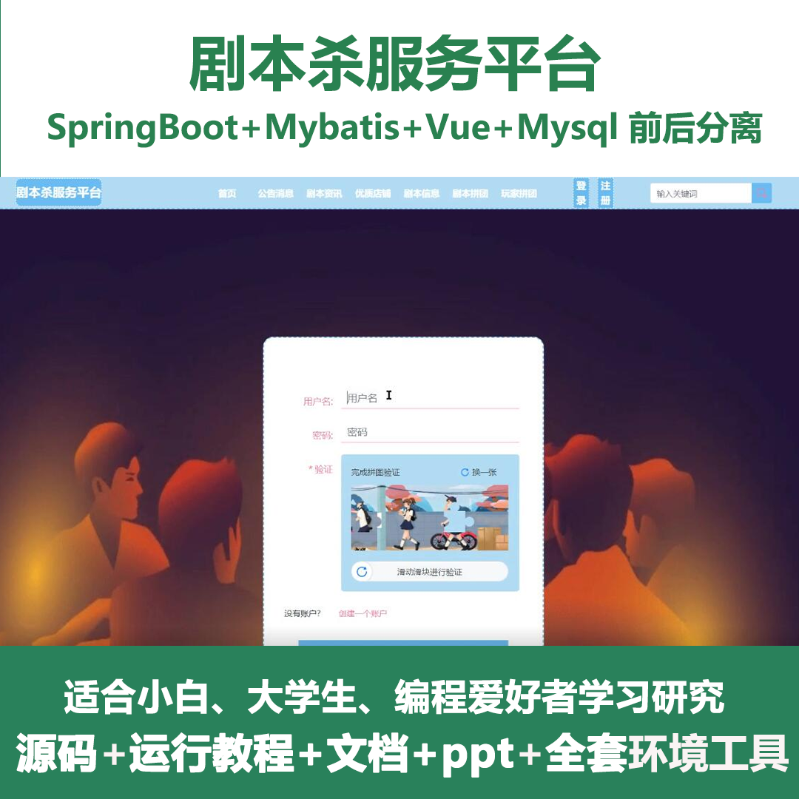
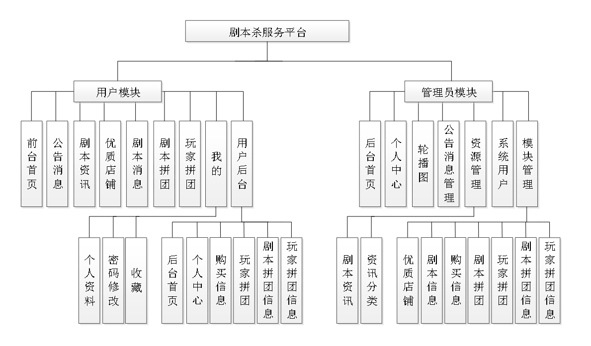
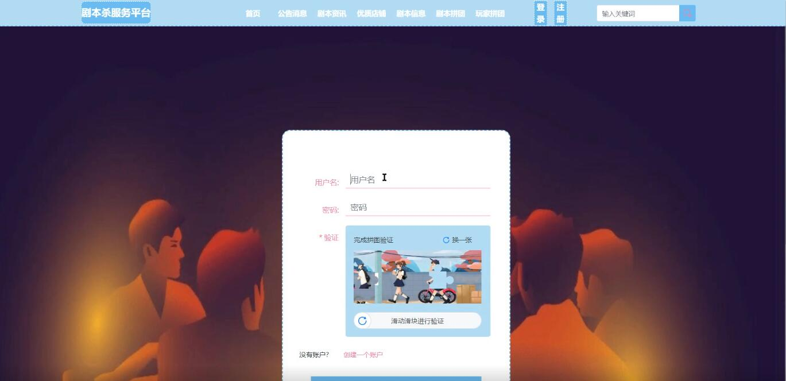
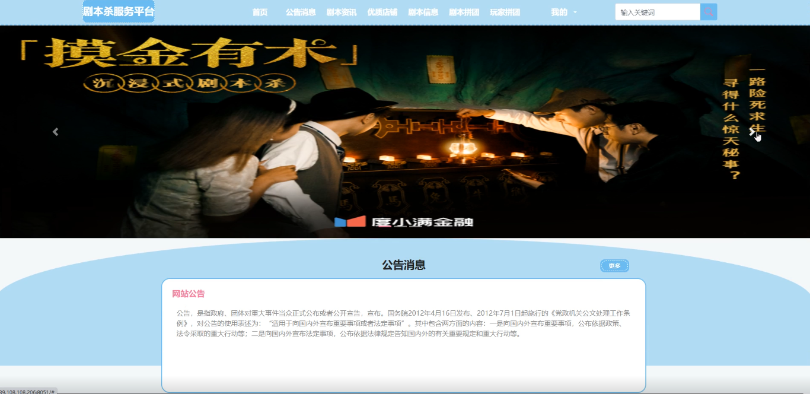
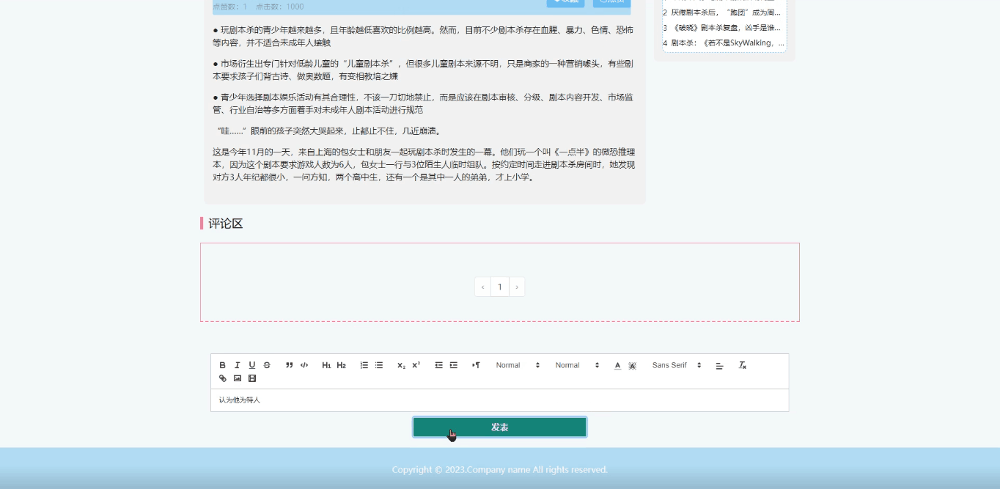
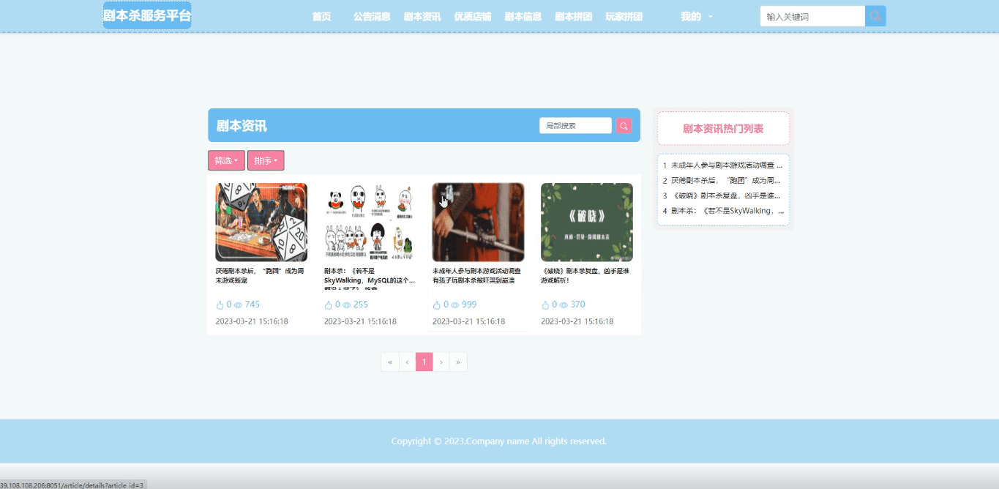
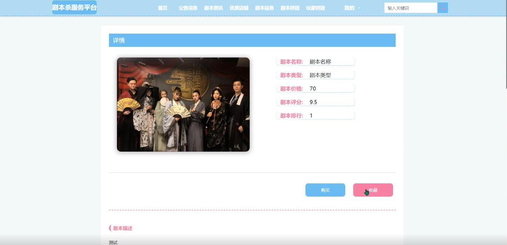
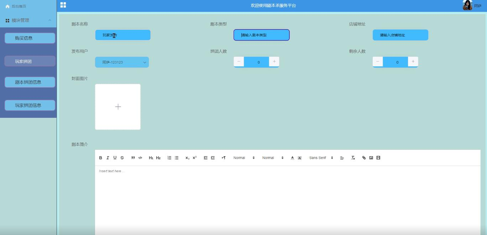
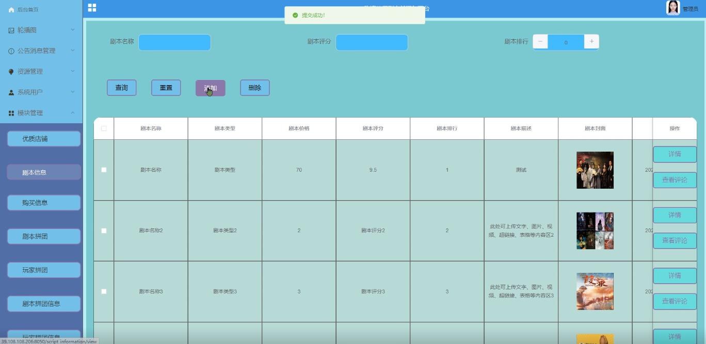
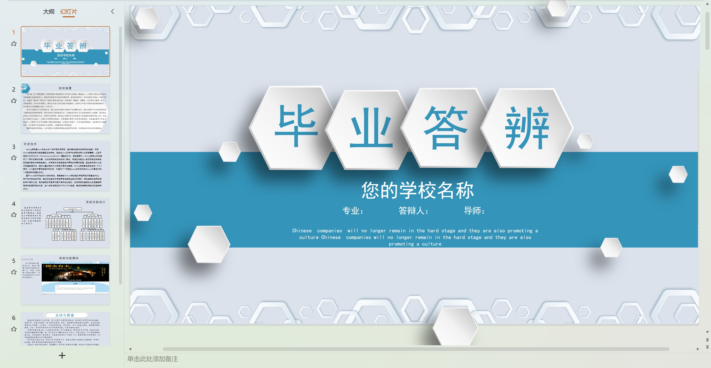

# springbootA283
springbootA283基于Java Springboot剧本杀服务平台
 
## 查看主页获取源码

### 一、作品包含

源码+数据库+设计文档万字+PPT+全套环境和工具资源+部署教程

### 二、项目技术

前端技术：Html、Css、Js、Vue、Element-ui

数据库：MySQL

后端技术：Java、Spring Boot、MyBatis

  

### 三、运行环境

开发工具：IDEA

数据库：MySQL8.0

数据库管理工具：Navicat10以上版本

环境配置软件： JDK1.8+Maven3.6.3

前端Nodejs：14

### 四、项目介绍
项目编号：springbootA283

剧本杀作为一种新兴的社交娱乐方式，近年来在我国迅速崛起并广受欢迎。随着市场的不断扩大，各类剧本杀服务平台应运而生，为玩家提供剧本创作、预约组局、线下体验等一站式服务。然而，在剧本杀行业快速发展的背后，也暴露出服务质量参差不齐、内容同质化严重等问题。本文旨在探讨剧本杀服务平台的现状、存在问题及发展对策，为行业健康发展提供理论支持和实践指导。

前台用户功能：前台首页、公告消息、剧本资讯、优质店铺、剧本消息、剧本拼团、玩家拼团、用户后台、个人资料、密码修改、收藏。

后台分为管理员和用户
管理员的功能：后台首页、个人中心、轮播图、公告消息管理、系统用户、剧本资讯、资讯分类、优质店铺、剧本信息、购买信息、剧本拼团、玩家拼团、剧本拼团信息、玩家拼团信息。
用户的功能：后台首页、个人中心、购买信息、玩家拼团、剧本拼团信息、玩家拼团信息。

### 五、运行截图

  
